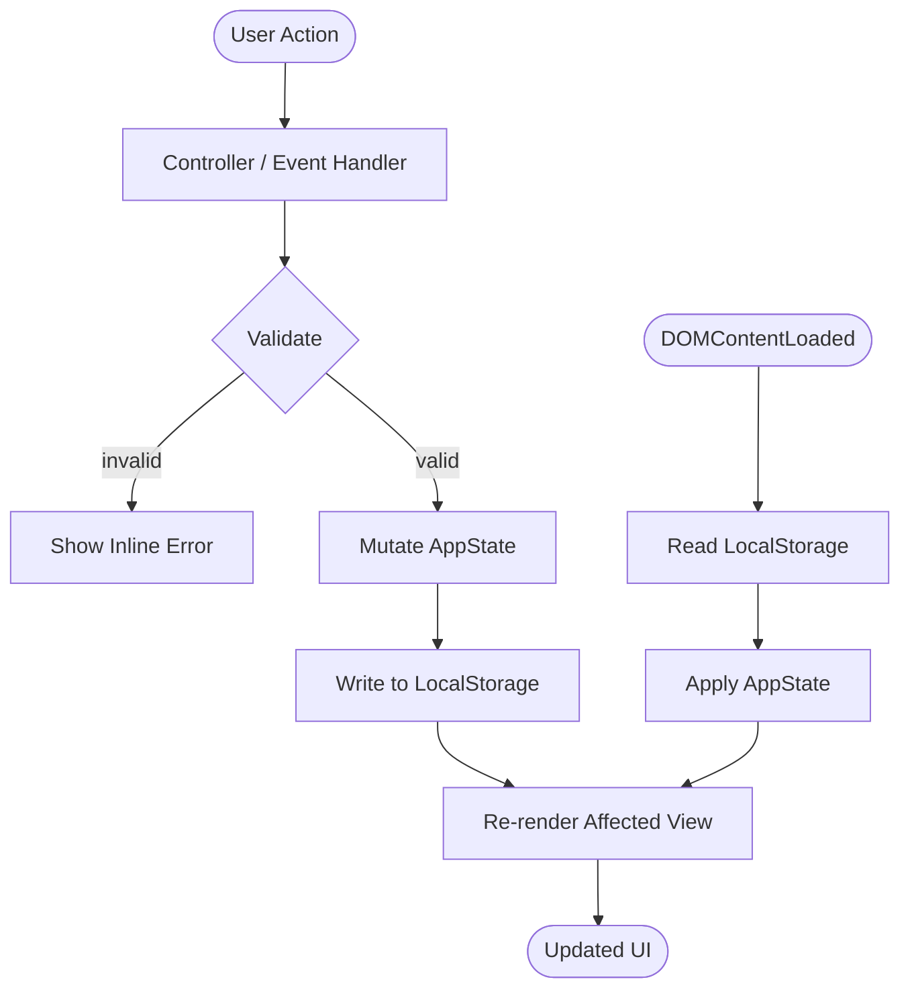

# Design Document: Expense & Budget Visualizer

## Overview

The Expense & Budget Visualizer is a fully client-side web application built with HTML, CSS, and Vanilla JavaScript. It runs entirely in the browser without a server, persisting all data to the browser's Local Storage API. The app lets users record expense transactions, organise them into custom categories, review monthly spending summaries backed by a canvas chart, sort the transaction list, set per-category budget limits with visual warnings, and toggle between dark and light colour schemes.

Because there is no build step, bundler, or backend, the architecture is intentionally flat: one HTML entry point, one CSS file, and one JavaScript module. All feature logic lives in the JavaScript layer; the HTML provides static structure and the CSS provides all visual states via class toggling.

### Design Goals

- **Zero dependencies** — no frameworks, no CDN scripts, no npm.
- **File-system portable** — must open from `file://` with no CORS issues.
- **Fast initialisation** — full render in under 500 ms for up to 1 000 transactions.
- **Defensive persistence** — every mutation writes to storage before updating the DOM; corrupted storage is discarded gracefully.
- **Accessible** — WCAG 2.1 AA contrast ratios in both themes.

---

## Architecture

The application follows a **unidirectional data flow** pattern inside a single JavaScript module:

```
User Action → Controller → State Mutation → Storage Write → View Render
```

There is no reactive framework. The controller functions are plain event handlers that mutate a single in-memory `AppState` object, flush it to `localStorage`, and then call the relevant render functions.

### File Structure

```
index.html          ← Single entry point; all markup, no inline JS
css/
  style.css         ← All visual styles, CSS custom properties for themes
js/
  app.js            ← All application logic
```

### Module Layout inside `app.js`

The file is divided into clearly labelled sections using block comments:

```
app.js
├── CONSTANTS          — default categories, validation limits, storage key
├── STATE              — AppState object (in-memory source of truth)
├── STORAGE            — read / write / corrupt-recovery helpers
├── VALIDATION         — pure validation functions
├── TRANSACTIONS       — add / delete business logic
├── CATEGORIES         — add / delete / merge business logic
├── SORT               — pure sort comparators + apply-sort helper
├── MONTHLY SUMMARY    — aggregation and chart-data derivation
├── BUDGET LIMITS      — set / evaluate threshold logic
├── THEME              — toggle / detect OS preference / apply
├── RENDER             — all DOM-writing functions (no logic)
└── INIT               — DOMContentLoaded bootstrap
```

### Data Flow Diagram



---

## Components and Interfaces

### 1. Storage Module

Responsible for all LocalStorage I/O. The entire `AppState` is serialised as a **single JSON string** under the key `"ebv_data"`.

**Interface:**

```js
StorageModule.save(state: AppState): void
// Serialises state to JSON and writes to localStorage["ebv_data"].
// Catches QuotaExceededError / SecurityError and calls notifyStorageError().

StorageModule.load(): AppState | null
// Reads and JSON-parses localStorage["ebv_data"].
// Returns null if key absent, storage unavailable, or JSON invalid.

StorageModule.isAvailable(): boolean
// Probes localStorage with a test write/delete; returns true if usable.
```

### 2. Validation Module

Pure functions — no side effects, no DOM access.

```js
ValidationModule.validateTransaction(fields): ValidationResult
// fields: { name, amount, date, categoryId }
// Returns { valid: boolean, errors: { [field]: string } }

ValidationModule.validateCategory(name, existingCategories): ValidationResult
// Returns { valid: boolean, errors: { name: string } }

ValidationModule.validateBudgetLimit(value): ValidationResult
// Returns { valid: boolean, error: string }
```

`ValidationResult` shape:
```js
{
  valid: boolean,
  errors: Object<string, string>   // field → human-readable message
}
```

### 3. Transaction Module

```js
TransactionModule.add(state, fields): AppState
// Returns new state with transaction appended; does NOT mutate argument.

TransactionModule.delete(state, transactionId): AppState
// Returns new state with transaction removed.

TransactionModule.getForMonth(state, year, month): Transaction[]
// Returns all transactions where transaction.date falls in year/month.
```

### 4. Category Module

```js
CategoryModule.getAll(state): Category[]
// Merges default categories with user-created ones; deduplicates case-insensitively.

CategoryModule.add(state, name): AppState

CategoryModule.delete(state, categoryId): AppState
// Throws if any transaction references this categoryId.
```

### 5. Sort Module

```js
SortModule.comparators = {
  amountAsc:  (a, b) => ...,  // secondary: date desc
  amountDesc: (a, b) => ...,  // secondary: date desc
  categoryAz: (a, b) => ...   // case-insensitive alphabetical
}

SortModule.apply(transactions, sortOrder): Transaction[]
// Returns a new sorted array; does not mutate input.
```

`sortOrder` is one of `"amountAsc" | "amountDesc" | "categoryAz"`.

### 6. Monthly Summary Module

```js
SummaryModule.aggregate(transactions): SummaryData
// Returns { total: number, byCategory: { [categoryId]: number } }
// Categories with zero spend are absent from byCategory.

SummaryModule.toChartData(summaryData, categoryNames): ChartData
// Returns { labels: string[], values: number[], percentages: number[] }
// percentages sum to 100 (last slice absorbs floating-point remainder).
```

### 7. Budget Limit Module

```js
BudgetModule.isExceeded(categoryId, summaryData, budgetLimits): boolean
// Returns true iff budgetLimits[categoryId] exists AND
//   summaryData.byCategory[categoryId] >= budgetLimits[categoryId]

BudgetModule.getExceededCategories(summaryData, budgetLimits): Set<string>
// Returns the set of categoryIds that are at or over their limit.
```

### 8. Theme Module

```js
ThemeModule.getPreferred(): 'light' | 'dark'
// Reads window.matchMedia('(prefers-color-scheme: dark)');
// falls back to 'light' if API unavailable.

ThemeModule.apply(theme): void
// Sets data-theme attribute on <html>; CSS handles all visual changes.

ThemeModule.toggle(currentTheme): 'light' | 'dark'
// Returns the opposite theme value.
```

### 9. Render Module

All functions write to the DOM only — no logic, no validation.

```js
RenderModule.renderTransactionList(transactions, categories)
RenderModule.renderMonthlySummary(summaryData, categories, budgetLimits)
RenderModule.renderChart(chartData)           // HTML5 Canvas pie chart
RenderModule.renderCategorySelector(categories)
RenderModule.renderMonthSelector(availableMonths, selectedMonth)
RenderModule.renderBudgetLimitInputs(categories, budgetLimits)
RenderModule.showValidationErrors(errors)
RenderModule.clearValidationErrors()
RenderModule.showNotification(message, type)  // type: 'error' | 'info'
RenderModule.applyTheme(theme)
```

### 10. Chart (Canvas Renderer)

Implemented directly in `RenderModule.renderChart`. Uses the HTML5 Canvas 2D API to draw a **pie chart**:

- Each category slice is a proportional arc, filled with a colour from a fixed palette (cycling if > palette length).
- Each slice has a text label: `"{category}: {percentage}%"` drawn outside the arc.
- If `chartData.labels` is empty, "No data" is drawn centred in the canvas.

---

## Data Models

All models are plain JavaScript objects serialised to JSON.

### AppState

```js
{
  transactions:  Transaction[],
  categories:    Category[],        // user-created only; defaults always merged at runtime
  budgetLimits:  BudgetLimitMap,    // { [categoryId]: number }
  sortOrder:     SortOrder,         // 'amountAsc' | 'amountDesc' | 'categoryAz'
  theme:         'light' | 'dark',
  selectedMonth: MonthKey           // 'YYYY-MM' string, e.g. '2025-07'
}
```

### Transaction

```js
{
  id:         string,   // crypto.randomUUID() or Date.now().toString() fallback
  name:       string,   // 1-100 characters
  amount:     number,   // 0.01 – 999,999,999.99
  date:       string,   // ISO 8601 date 'YYYY-MM-DD'
  categoryId: string    // references Category.id
}
```

### Category

```js
{
  id:       string,   // slugified name for defaults; UUID for user-created
  name:     string,   // 1-50 characters
  isDefault: boolean
}
```

**Default categories** (hard-coded in CONSTANTS, never stored):

| id            | name            |
|---------------|-----------------|
| `food`        | Food            |
| `transport`   | Transport       |
| `entertainment` | Entertainment |
| `health`      | Health          |
| `other`       | Other           |

### BudgetLimitMap

```js
{
  [categoryId: string]: number   // value in the same currency unit as amounts
}
```

### SortOrder

```js
type SortOrder = 'amountAsc' | 'amountDesc' | 'categoryAz'
```

Default when nothing is stored: `'amountAsc'`.

### MonthKey

A `'YYYY-MM'` string derived by slicing the first 7 characters of a transaction's ISO date. Example: `'2025-07'`.

### Storage Layout

```
localStorage key: "ebv_data"
value: JSON.stringify(AppState)
```

If the stored value cannot be parsed, the app discards it, initialises with empty default state, and shows a persistent error notification.

---

## Correctness Properties

*A property is a characteristic or behavior that should hold true across all valid executions of a system — essentially, a formal statement about what the system should do. Properties serve as the bridge between human-readable specifications and machine-verifiable correctness guarantees.*

### Property 1: Transaction Add Round-Trip

*For any* valid transaction (name 1–100 chars, amount 0.01–999 999 999.99, date not in the future, valid categoryId), adding it to any app state should result in: (a) the transaction appearing in the transaction list returned by `TransactionModule.getForMonth` for its month, and (b) the transaction being present in the state returned by `StorageModule.load()` after `StorageModule.save()`.

**Validates: Requirements 1.2, 7.2**

---

### Property 2: Invalid Transaction Rejection

*For any* transaction where at least one required field is empty, or the amount is non-numeric / zero / negative / above 999 999 999.99, or the date is in the future, `ValidationModule.validateTransaction` should return `valid: false` and the app state should remain unchanged after attempted submission.

**Validates: Requirements 1.3, 1.4**

---

### Property 3: Transaction Deletion Removes from State

*For any* app state containing at least one transaction and *any* transactionId in that state, calling `TransactionModule.delete` should produce a state where that transactionId no longer appears in `state.transactions`, and the resulting state's `transactions` length should be exactly one less than before.

**Validates: Requirements 1.6**

---

### Property 4: Category Add Round-Trip

*For any* category name that is non-empty, at most 50 characters, and not already present (case-insensitive) in the combined category list, adding it should result in: (a) the name appearing in `CategoryModule.getAll(state)`, and (b) the category being recoverable from storage after save/load.

**Validates: Requirements 2.2, 2.7**

---

### Property 5: Category Duplicate Rejection

*For any* category name that is empty or already exists case-insensitively in the current category list, `ValidationModule.validateCategory` should return `valid: false`, and `CategoryModule.getAll` should contain no duplicate names after the attempted add.

**Validates: Requirements 2.3, 2.4**

---

### Property 6: Category Delete Guard

*For any* category that has at least one transaction referencing it, `CategoryModule.delete` should throw (or return an error result), leaving the category and all transactions intact in the state.

**Validates: Requirements 2.6**

---

### Property 7: Category Merge Deduplication

*For any* set of user-created categories (including names that match default category names in any letter casing), `CategoryModule.getAll` should return a list where every name is unique when compared case-insensitively, and all five default categories are always present.

**Validates: Requirements 2.1, 2.7**

---

### Property 8: Monthly Summary Aggregation Correctness

*For any* set of transactions in a given month, `SummaryModule.aggregate` should return a `total` equal to the sum of all transaction amounts (within floating-point tolerance), and each `byCategory` value should equal the sum of amounts for that category only; categories with no transactions in that month should be absent from `byCategory`.

**Validates: Requirements 3.2**

---

### Property 9: Chart Percentages Sum to 100

*For any* non-empty `SummaryData`, `SummaryModule.toChartData` should return `percentages` that sum to exactly 100 (with the last slice absorbing floating-point remainder), and each `percentages[i]` should be proportional to `values[i] / total`.

**Validates: Requirements 3.3**

---

### Property 10: Sort Correctness and Non-Destructiveness

*For any* list of transactions and *any* `SortOrder`, `SortModule.apply` should return a new array that: (a) contains exactly the same transactions as the input (same length, same ids), (b) is ordered correctly for the chosen criterion (amount asc/desc with date-desc tie-break; or category name A-Z case-insensitive), and (c) does not mutate the input array.

**Validates: Requirements 4.1, 4.2**

---

### Property 11: Sort Invariant Preserved After Mutation

*For any* sorted list of transactions and *any* valid new transaction added (or existing one deleted), the resulting list returned after the mutation should still satisfy the active sort order — i.e., `SortModule.apply(newList, sortOrder)` should equal `newList`.

**Validates: Requirements 4.3, 4.4**

---

### Property 12: Sort Order Persistence Round-Trip

*For any* `SortOrder` value (`'amountAsc'`, `'amountDesc'`, `'categoryAz'`), saving an app state containing that sort order and loading it back should restore the same sort order.

**Validates: Requirements 4.5**

---

### Property 13: Budget Limit Threshold Detection

*For any* category with a budget limit set, `BudgetModule.isExceeded` should return `true` if and only if the category's total spend in `summaryData` is greater than or equal to the budget limit; and should return `false` for any category that has no budget limit set, regardless of spend amount.

**Validates: Requirements 5.3, 5.4, 5.5, 5.6**

---

### Property 14: Budget Limit Validation

*For any* budget limit value that is non-numeric, zero, negative, or above 999 999 999.99, `ValidationModule.validateBudgetLimit` should return `valid: false`; for any value in [0.01, 999 999 999.99], it should return `valid: true`.

**Validates: Requirements 5.7**

---

### Property 15: Theme Persistence Round-Trip

*For any* theme value (`'light'` or `'dark'`), saving an app state containing that theme and loading it back should restore the same theme value.

**Validates: Requirements 6.3, 6.4**

---

### Property 16: App State JSON Round-Trip

*For any* valid `AppState` object, `JSON.parse(JSON.stringify(state))` should produce a value that is deeply equal to the original state (all transactions, categories, budget limits, sort order, and theme preserved).

**Validates: Requirements 7.4**

---

## Error Handling

### Storage Errors

| Scenario | Behaviour |
|---|---|
| `localStorage` unavailable on load | Display persistent error notification; render empty state; app remains usable in memory only |
| `localStorage` unavailable on write | Catch the error; keep in-memory state; display error notification; do not roll back user action |
| Stored JSON is corrupt / unparseable | Discard the value; initialise with empty default state; display error notification |
| `QuotaExceededError` on write | Same as write unavailable — notify user, retain memory state |

### Validation Errors

All validation errors are **inline** — rendered adjacent to the offending field, not as modal dialogs or page-level banners. Each field's error element is a `<span role="alert">` pre-rendered in the HTML and shown/hidden by toggling a CSS class. Multiple fields can show errors simultaneously.

### Category Delete Conflict

When a user attempts to delete a category that has associated transactions, the app shows a warning message (not a blocking modal) explaining that all transactions in that category must be reassigned or deleted first. The category is not removed.

### Empty / No-Data States

- **No transactions stored**: Transaction list renders with a "No transactions yet" placeholder row.
- **No transactions for selected month**: Monthly summary shows a "No data for this period" message; the canvas chart renders the "No data" label.

### Confirmation Before Destructive Actions

Transaction deletion requires the user to confirm via `window.confirm()`. This is the simplest approach that works cross-browser without a custom dialog component.

---

## Testing Strategy

### Approach

Because this is a Vanilla JS application with no test runner installed, tests are written as **plain JavaScript test files** that can be run in Node.js (for pure-function unit tests) or loaded in a browser (for DOM/canvas tests). The property-based testing library chosen is **[fast-check](https://fast-check.dev/)** (loaded via a `<script>` tag from a local copy, or via CDN in the test HTML page).

> **Note:** No test setup is required in the main project. The test files live in a `tests/` directory alongside the main files and are run separately from development.

### Unit Tests (Example-Based)

These cover specific scenarios, edge cases, and UI interactions not amenable to property-based testing:

- **Storage unavailable on load** — simulate by overriding `localStorage` with a throwing stub; verify error notification shown and empty list rendered.
- **Corrupt JSON on read** — seed `localStorage` with `"not json"`; verify discard and error notification.
- **Delete confirmation prompt** — mock `window.confirm`; verify transaction is removed only when `confirm` returns `true`.
- **No-data month** — select a month with no transactions; verify "no data" message and empty chart label.
- **Theme from OS preference** — mock `window.matchMedia`; verify dark/light applied correctly when no stored preference.
- **Theme fallback to light** — no stored preference + no OS preference; verify `'light'` applied.
- **Budget limit input present** — verify DOM contains a budget input per category.
- **Default categories present on first load** — verify five default categories after fresh init.

### Property-Based Tests

Using **fast-check** with a minimum of **100 iterations** per property. Each test is tagged with its design property:

```
// Feature: expense-budget-visualizer, Property 1: Transaction Add Round-Trip
```

| Test | fast-check Arbitraries | Property Validated |
|---|---|---|
| Transaction add round-trip | `fc.record({ name: fc.string({minLength:1,maxLength:100}), amount: fc.float({min:0.01,max:999999999.99}), date: fc.date({max: new Date()}), categoryId: fc.constantFrom(...validIds) })` | Property 1 |
| Invalid transaction rejection | Arbitrary over invalid field combinations (empty name, out-of-range amount, future date) | Property 2 |
| Transaction deletion removes from state | `fc.array(validTransaction, {minLength:1})` then pick random index to delete | Property 3 |
| Category add round-trip | `fc.string({minLength:1, maxLength:50})` filtered to not match existing | Property 4 |
| Category duplicate rejection | Category name drawn from existing list (random casing) | Property 5 |
| Category delete guard | State with ≥1 transaction in a category, attempt delete | Property 6 |
| Category merge deduplication | `fc.array(fc.string())` including default names in various casings | Property 7 |
| Monthly summary aggregation | `fc.array(validTransaction)` all in same month | Property 8 |
| Chart percentages sum to 100 | `fc.array(fc.float({min:0.01}), {minLength:1})` as category totals | Property 9 |
| Sort correctness and non-destructiveness | `fc.array(validTransaction, {minLength:0})` × `fc.constantFrom('amountAsc','amountDesc','categoryAz')` | Property 10 |
| Sort invariant after mutation | Sorted list + arbitrary valid new transaction or deletion | Property 11 |
| Sort order persistence round-trip | `fc.constantFrom('amountAsc','amountDesc','categoryAz')` | Property 12 |
| Budget limit threshold detection | `fc.record({ spend: fc.float({min:0}), limit: fc.float({min:0.01}) })` | Property 13 |
| Budget limit validation | `fc.oneof(fc.float({min:0.01,max:999999999.99}), fc.constant(0), fc.float({max:-0.01}), fc.string())` | Property 14 |
| Theme persistence round-trip | `fc.constantFrom('light','dark')` | Property 15 |
| App state JSON round-trip | Arbitrary `AppState` built from composing the above arbitraries | Property 16 |

### Integration / Performance Tests

- **Render performance**: Load the app with 999 transactions injected into `localStorage`; measure time from `DOMContentLoaded` to last DOM paint using `performance.now()`; assert < 500 ms.
- **file:// compatibility**: Manual verification — open `index.html` directly from the file system in Chrome, Firefox, Edge, and Safari; confirm all features work without CORS or security errors.

### Accessibility

WCAG 2.1 AA contrast compliance for both themes requires manual review with a browser accessibility tool (e.g., axe DevTools or Chrome Lighthouse) because programmatic contrast checking against live CSS custom properties is not reliable in a pure-JS test environment.
